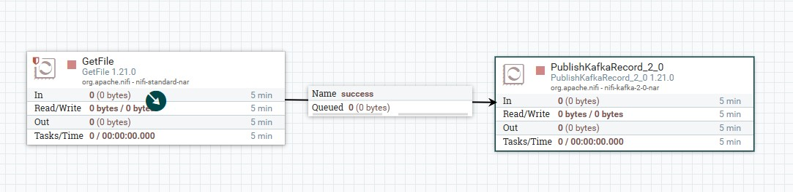
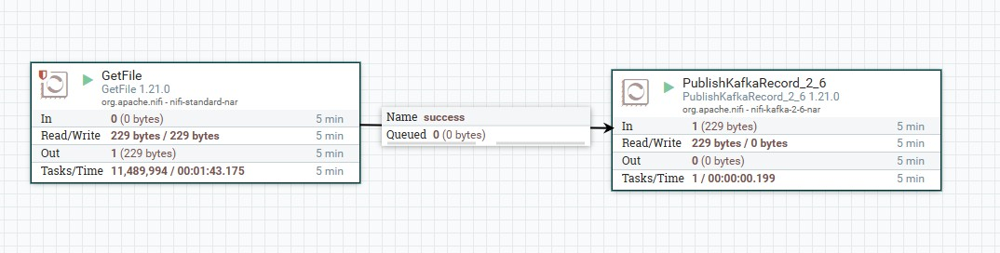

### Задание 1
1. Начнем с развертывания кластера кафка в Yandex Cloud. Перейдем в панель и в поиске найдем Kafka, создать кластер.
2. Настройки кластера следующие: 
Имя кластера kafka681  
Окружение Production  
Версия Kafka 3.5  
Реестр схем данных - да  
Т.к. кластер настраивается в учебных целях, то будем считать, что основная цель экономно расходовать грант, поэтому будем стараться выбирать самые недорогие компоненты.  
Тип: Intel Ice Lake  
2 ядра, в гб памяти (для продакшен среды мы выбрали бы минимум 64 гб памяти и 16 ядер)  
Мы не планируем писать много данных, поэту нам хватит 32 гб сетевого SSD, обеспечивающего скорость 1000 операций в секунду  
Зона доступности, выбираем ru-central1-a, ru-central1-b, ru-central1-c  
Создадим сеть kafka-network и подсети ru-central-a, b и c соответственно.  
Публичный доступ - да  
Количество брокеров в зоне - нам хватит по 1  
Для ZooKeeper также выберем самую экономичную конфигурацию: Intel Ice Lake, 2 ядра, в гб памяти
Дополнительные настройки:
Кодек сжатия GZIP  
Default replication factor 3  
Log retention hours 12
Log segment bytes 1024 (намеренно зададим низкое значение, чтобы увидеть, как работает сжатие)
  
Дождемся создания кластера.

3. После создания кластера создадим тестовый топик test.
4. Создадим пользователя producer и consumer, дадим им права на запись и чтение в топик соответственно.
5. Запустим продьесер и консьюмер. Убедимся, что сообщения записываются и читаются (см. [logs](logs/task1/application.log))

### Задание 2
1. Создадим докер компоуз ./nifi/docker-compose.yml
2. Подготовим data.csv файл с данными, которые затем будут переданы в кафку
```csv
id,name,age,email 
1,Екатерина,21,kate@yandex.ru 
2,Никита,26,nikita@yandex.ru 
3,Майя,21,maya@yandex.ru 
4,Алексей,26,alex@yandex.ru 
5,Илья,25,ilya@yandex.ru 
6,Виктория,22,vika@yandex.ru 
```
3. Запустим проект и дождемся загрузки
```bash
docker compose -f ./nifi/docker-compose.yml up -d
```
4. Перейдем в веб интерфейс nifi http://localhost:8080/nifi/
5. Добавим процессор GetFile и настроим его:
    * Input Directory: /opt/nifi/nifi-current/data
    * Polling interval: 5 sec
6. Добавим второй процессор и настроим его
    * Kafka Brokers: rc1a-hle26o0d9368l3pt.mdb.yandexcloud.net:9091,rc1b-pp421aduloqh4jcg.mdb.yandexcloud.net:9091,rc1d-8igeb47sq8lqapoh.mdb.yandexcloud.net:9091
    * Topic Name: nifi-users
    * Use Transactions: false
    * Security Protocol: SASL_SSL
    * SASL Mechanism: SCRAM-SHA-512
    * Username: producer
    * password 12345678
    * Record Reader: CSVReader 
    * Record Writer: JsonRecordSetWriter
    * Переведем Reader и Writer в статус Enabled
    * SSL Context Service: StandardRestrictedSSLContextService
    * В нем укажем путь к JKS, пароль и тип



7. Запустим процессоры. Видим, что процессоры обработали 227 байт данных. В логах ()) видим, что данные были прочитаны и отправлены


8. Убедимся, что данные действительно отправлены в кафку. 
```bash
 kafka-console-consumer.sh \
    --bootstrap-server rc1a-hle26o0d9368l3pt.mdb.yandexcloud.net:9091,rc1b-pp421aduloqh4jcg.mdb.yandexcloud.net:9091,rc1d-8igeb47sq8lqapoh.mdb.yandexcloud.net:9091 \
    --topic nifi-users \
    --property print.key=true \
    --property key.separator=":" \
    --consumer-property security.protocol=SASL_SSL \
    --consumer-property sasl.mechanism=SCRAM-SHA-512 \
    --consumer-property ssl.truststore.location=module5/certs/ssl \
    --consumer-property ssl.truststore.password=123456 \
    --consumer-property sasl.jaas.config="org.apache.kafka.common.security.scram.ScramLoginModule required username='consumer' password='12345678';"
```
Прочитанные данные (поплыла кодировка в Git Bash)
```text
1:{"id":1,"name":"╨Х╨║╨░╤В╨╡╤А╨╕╨╜╨░","age":21,"email":"kate@yandex.ru"}
5:{"id":5,"name":"╨Ш╨╗╤М╤П","age":25,"email":"ilya@yandex.ru"}
2:{"id":2,"name":"╨Э╨╕╨║╨╕╤В╨░","age":26,"email":"nikita@yandex.ru"}
3:{"id":3,"name":"╨Ь╨░╨╣╤П","age":21,"email":"maya@yandex.ru"}
4:{"id":4,"name":"╨Р╨╗╨╡╨║╤Б╨╡╨╣","age":26,"email":"alex@yandex.ru"}
6:{"id":6,"name":"╨Т╨╕╨║╤В╨╛╤А╨╕╤П","age":22,"email":"vika@yandex.ru"}
```


